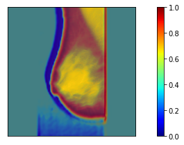
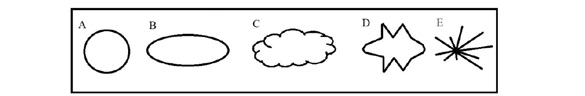

# Breast Cancer

| Sample | Saliency Map | Grad-CAM | Grad-CAM ++ |
|---------|---------|---------|---------|
|  |  |  |  |

The Breast Cancer project focuses on visualizing and interpreting deep learning models applied to breast cancer diagnosis. It utilizes techniques like Saliency Maps, Grad-CAM, and Grad-CAM++ to highlight regions in medical images that influence model predictions.

## About the Dataset
- 1st column: MIAS database reference number.

- 2nd column: Character of background tissue: F Fatty ,G Fatty-glandular ,D Dense-glandular

- 3rd column: Class of abnormality present: CALC Calcification ,CIRC Well-defined/circumscribed masses ,SPIC Spiculated masses ,MISC Other, ill-defined masses ,ARCH Architectural distortion ,ASYM Asymmetry ,NORM Normal

- 4th column: Severity of abnormality; B Benign ,M Malignant

- 5th, 6th columns: x,y image-coordinates of centre of abnormality.

- 7th column: Approximate radius (in pixels) of a circle enclosing the abnormality.

## The structure of the malignant and benign:
- Benign masses have a circular or oval shape, while malignant masses are irregular in shape and contain small, needle-like masses.

